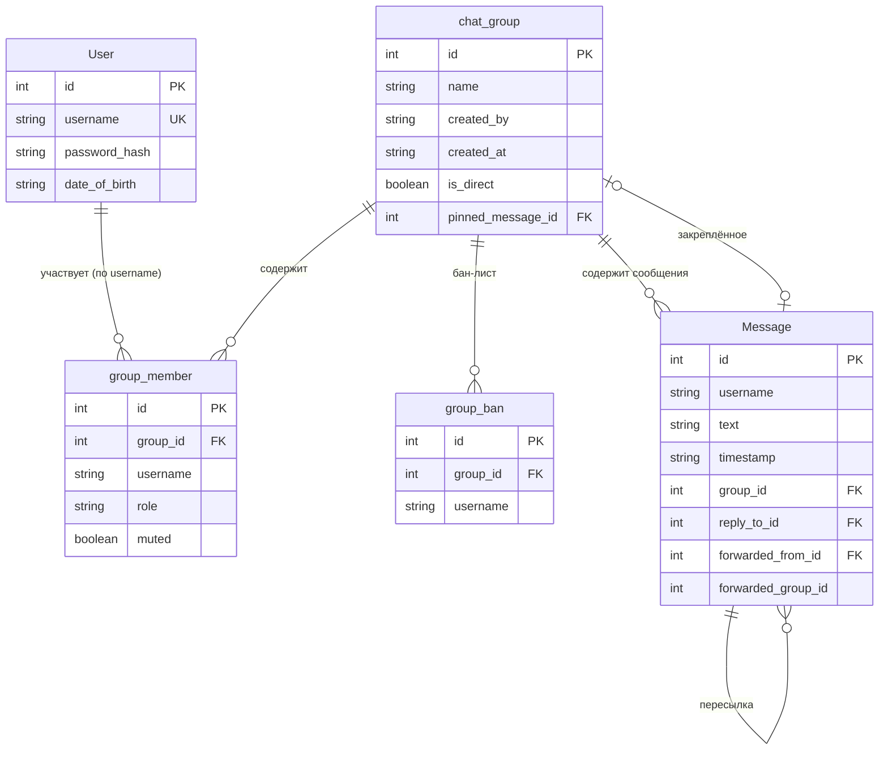

# Half Chat

Чат-бекенд на FastAPI + PostgreSQL с JWT-авторизацией, групповыми комнатами и WebSockets в реальном времени.

## Запуск

```bash
bash dev.sh install      # poetry install
bash dev.sh db:init      # создать БД и таблицы
bash dev.sh db:migrate   # применить миграции
bash dev.sh start        # uvicorn main:app --reload
```

## Docker

```bash
bash dev.sh docker:up    # docker compose up --build (app + postgres)
bash dev.sh docker:down  # docker compose down
```

Поднимаются два сервиса: `db` (postgres:16) и `app` (build из `Dockerfile`). При старте применяются миграции, затем запускается uvicorn на `:8000`. Конфиг — через env `DATABASE_URL` и `SECRET_KEY` (`db_config.py` в контейнер не попадает).

## Конфигурация

Credentials БД — в `half_chat/db_config.py` (gitignored, скопируй с `db_config.example.py`), либо через env `DATABASE_URL`.

| Переменная | По умолчанию | Описание |
|---|---|---|
| `DATABASE_URL` | из `db_config.py` | Подключение к БД |
| `SECRET_KEY` | `super-secret-key-change-in-production` | Ключ для JWT |

## Эндпоинты

### Авторизация

| Метод | Путь | Описание | Auth |
|---|---|---|---|
| `POST` | `/api/register` | Регистрация `{username, password, date_of_birth?}` (новый пользователь авто-добавляется в `general`) | Нет |
| `POST` | `/api/login` | Вход, возвращает `access_token` | Нет |

### Пользователи

| Метод | Путь | Описание | Auth |
|---|---|---|---|
| `GET` | `/api/users?q=` | Поиск пользователей по username | Нет |
| `GET` | `/api/users/{username}/status` | Статус онлайн/офлайн | Нет |
| `GET` | `/api/users/me` | Профиль текущего пользователя | Да |
| `PUT` | `/api/users/me` | Изменить username/дату рождения | Да |
| `PUT` | `/api/users/me/password` | Сменить пароль | Да |

### Группы

| Метод | Путь | Описание | Auth |
|---|---|---|---|
| `POST` | `/api/groups` | Создать группу `{name}` (создатель становится admin) | Да |
| `GET` | `/api/groups` | Список групп пользователя с `member_count` | Да |
| `POST` | `/api/groups/{id}/members` | Добавить участника `{username}` | Да |
| `POST` | `/api/groups/{id}/join` | Вступить в группу | Да |
| `POST` | `/api/groups/{id}/leave` | Выйти из группы | Да |
| `GET` | `/api/groups/{id}/members` | Список участников с ролями | Да |
| `PUT` | `/api/groups/{id}/members/{username}/role` | Сменить роль `{role}` (admin/moderator/member) | Да (админ) |
| `DELETE` | `/api/groups/{id}/members/{username}` | Удалить участника | Да (админ) |
| `POST` | `/api/groups/{id}/members/{username}/ban` | Забанить участника | Да (админ) |
| `POST` | `/api/groups/{id}/members/{username}/unban` | Разбанить участника | Да (админ) |
| `GET` | `/api/groups/{id}/banned` | Список забаненных | Да (админ) |
| `POST` | `/api/groups/{id}/members/{username}/mute` | Запретить писать сообщения | Да (админ) |
| `POST` | `/api/groups/{id}/members/{username}/unmute` | Снять запрет на сообщения | Да (админ) |
| `POST` | `/api/directs` | Создать/вернуть личный чат 1-на-1 `{username}` (idempotent) | Да |
| `GET` | `/api/directs` | Список личных чатов с peer | Да |

### Сообщения

| Метод | Путь | Описание | Auth |
|---|---|---|---|
| `POST` | `/api/messages` | Отправить `{text, group_id, reply_to_id?}`; `@username` в тексте создаёт уведомление | Да |
| `GET` | `/api/messages?group_id=&after_id=&limit=` | История сообщений (удал. видят: админ в группах, автор в личках) | Да |
| `GET` | `/api/messages/search?q=&group_id?=&limit=` | Поиск по тексту сообщений (в своих группах) | Да |
| `PUT` | `/api/messages/{id}` | Редактировать текст | Да (свои) |
| `DELETE` | `/api/messages/{id}` | Удалить сообщение (soft-delete) | Да (свои) |
| `POST` | `/api/messages/{id}/forward` | Переслать `{group_id}` в другую группу | Да |
| `POST` | `/api/messages/{id}/pin` | Закрепить сообщение в группе | Да |
| `POST` | `/api/messages/{id}/unpin` | Открепить сообщение | Да |

### WebSockets

| Метод | Путь | Описание |
|---|---|---|
| `WS` | `/api/ws/{group_id}?token=` | События: `new_message`, `update_message`, `delete_message`, `mention`, `presence`, `pin_message`, `unpin_message` |

## Структура БД



## Миграции

```bash
bash dev.sh db:new-migration "описание"   # alembic revision --autogenerate
bash dev.sh db:migrate                    # alembic upgrade head
```

## Стек

- Python 3.14, FastAPI, SQLModel, PostgreSQL
- WebSockets (`websockets`), JWT (`python-jose`), bcrypt (`passlib`)
- Миграции: Alembic
- Линтеры (dev): black, isort, flake8, mypy
